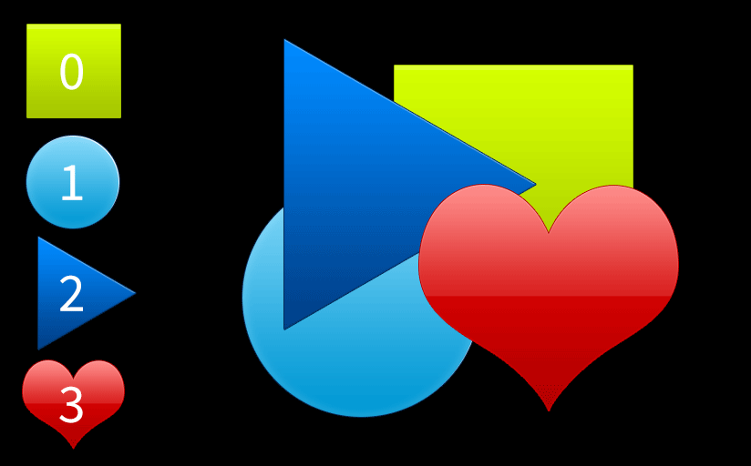

# Sprite \*

## Sprite

### Alpha

`Alpha` determines the opacity of a **Sprite** with 0 being completely transparent and 1 being completely opaque.

### Flip U / Flip V

The horizontal and vertical coordinates in most 2D graphics programs are referred to as _XY_ coordinates. In 3D applications, though, it is conventional to call these _UV_ coordinates to differentiate between 3D _mesh_ transformation coordinates and 2D _texture_ transformation coordinates.

The `Flip U` and `Flip V` **Attributes** simply inverts the direction of the corresponding axis, meaning that`Flip U` flips a **Sprite** _horizontally_, while `Flip V` will flip it _vertically_.

### Sort Index

Because **INCARI** works in 3D, it has no way of automatically discerning which elements should be shown on top of which, when they occupy the same area in 3D space. It is therefore necessary to manually define the _sort order_ of **Sprites** to ensure that they are layered correctly.

This is done by manipulating the `Sort Index` **Sprites** with higher values being rendered above lower values. If **Sprites** have the same `Sort Index` **Value**, then there is no guarantee that they will be shown correctly, and it is therefore recommend that you assign a unique **Value** to each **Sprite** unless you are certain that they will never overlap one another.

