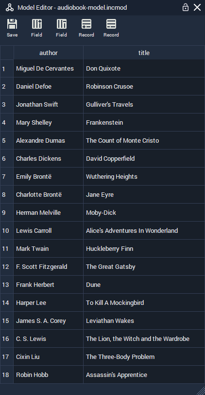

# List Widget
- genetate list to apply

## Title

This is the optional text that you wish to appear as a header for your list. It works like a `<h1>` tag in HTML. 

## Font Family

`Font Family` allows you to select a generic font family \(`monospace`, `serif`, `sans-serif`\) or add your own custom font.

## List Entry File

This takes a local .html file, which defines a template for how each list item is displayed. You can create one by right-clicking in the **Asset Manager** and selecting `Create asset` > `List Entry`. This method will create a new .html file, containing some example code.

The way that we populate our list with content from our **Model** file, is by creating placeholders, with the name of the corresponding **Field**, surrounded by double curly braces.

For example, let's say that we have a list of audiobooks, with two fields: `title` and `author`.

In our **List Entry File**, we would have the following:

```html
<h2><i>{{ title }}</i> by {{ author }}</h2>
```

This would make our list items look something like this:


To read more about basic HTML, take a look at [*HTML basics*](https://developer.mozilla.org/en-US/docs/Learn/Getting_started_with_the_web/HTML_basics) by Mozilla.

## INCARI Model File

A **Model File** is where you define all the data for your list. Physically, a book has many different properties. It has weight, size, number of pages etc., but when thinking in terms of a **Model**, we are thinking of what properties we need to represent in our data. If, going back to the audiobook example above, we just want to display two properties; the author and title of each audiobook, we create **Fields** for `title` and `author`.



**Fields** define a single aspect of each **Record** in a table and are displayed in columns. By double-clicking on the **Field**'s *header / label* we can define the name that will be used as a placeholder in the **List Entry File**.

**Records** are entries in the table and contain the data itself. By adding **Records**, we add more rows to the **Model**, and therefore, the **List**.

## Style File

`Style File` references a .css file, which contains style data for our **List**. The best way to create this file is by right-clicking in the **Asset Manager** and selecting `Create asset` > `List Style`. This creates a file, with all of the relevant IDs and classes already inside and ready to edit.

How to write CSS won't be discussed here, but there is an abundance of information online, such as 
[*Learn to style HTML using CSS*](https://developer.mozilla.org/en-US/docs/Learn/CSS) by Mozilla.

Here are the pre-defined classes and ID, to be used for styling **Lists** in INCARI.

- `#list` - 
- `.list` - 
- `.list-title` - 
- `.list-not-active` - 
- `.entry` - 
- `.entry-current` - 
- `.entry-selected` -


```css
body {
    color: white;    
    text-align: center;
}

.list-title {
    text-decoration: underline;
    color: lightblue;
}

.list-not-active { }

.entry {
    opacity: 0.8;
}

.entry-current {
    font-size: 1.2em;
    color: black;
    background-color: rgb(189, 7, 7); 
    opacity: 1;
    text-shadow: 1px 1px 1px rgb(177, 40, 40), -1px -1px 1px rgb(94, 1, 1);
}

```

## Generate List


# Simulation


# Common Attributes
- **Object** (All)
- **Transformation** (All)
- **Rotation Pivot** (All)
- **Effects**:
  - `Tint`
- **Web Resource**:
  - `Size (unit)`
  - `Show dev tools`
  - `Resolution (px)`
- **Sprite**:
  - `Alpha`
  - `Flip U`
  - `Flip V`
  - `Sort Index`