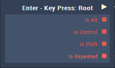
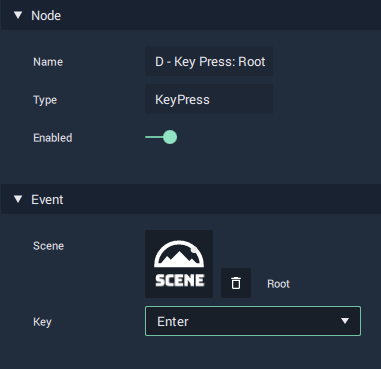
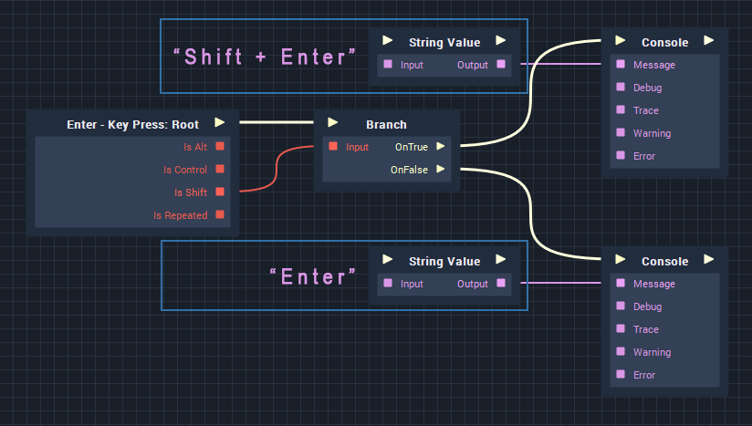

# KeyPress

### Overview

The **KeyPress** node is for purposefully triggering actions in **Incari Player**, by pressing a defined key.

Note that the **KeyPress** event is _continually-fired_ by default, and any logic following its output pulse will be called repeatedly, while the key is held down.

If you want to trigger the event only once per click, then you will need to plug the **Is Repeated** output  of the node into a **Branch** node to control the flow of your blueprint.

### Inputs and Outputs

In addition to having a single output [**Pulse**](../../../getting-started/terminology.md), the **KeyPress** node has four additional [**Boolean**](../../data-types/bool.md) outputs:

* **Is Alt** - Outputs as _true_ only if the **ALT** key is down when the assigned key is pressed; otherwise, the default value is _false_.
* **Is Control** - Outputs as _true_ only if the **CTRL** key is down when the assigned key is pressed; otherwise, the default value is _false_.
* **Is Shift** - Outputs as _true_ only if the **SHIFT** key is down when the assigned key is pressed; otherwise, the default value is _false_.
* **Is Repeated** - Outputs as _false_ the first time the key is pressed, and _true_ while it is being held down. This helps to prevent unintended re-firing of the event.

### Attributes

* **Name** - The assigned name of the node. Can't be edited.
* **Type** - The type of node, \(**KeyPress**\). Can't be edited.
* **Scene** - The scene which the key press applies to. The scene should be dragged and dropped onto the Scene property from the **Project Outliner**. This can be removed by clicking the trash can icon to the right of the "Scene" icon.
* **Key** - The keyboard key that you want Incari to listen for.

### Uses

Although your HMIs will be ultimately controlled by input from physical buttons, dials, knobs and CANBUS data, it is useful in the development stage, to be able to simulate this kind of input in real time, using only the keyboard.

### Examples

#### Basic

#### Intermediate

