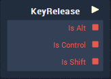
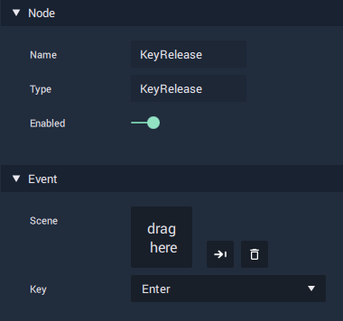
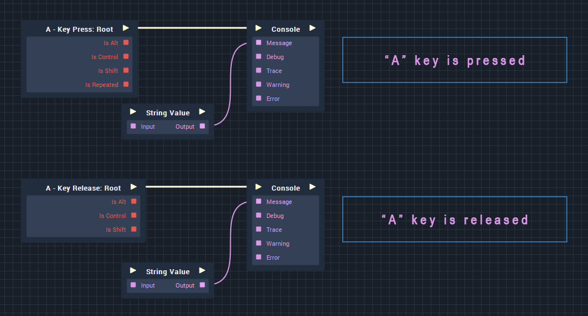

# KeyRelease

### Overview

The **KeyRelease** node is for purposefully triggering actions in **Incari Player**, after a key is released.

Note that the **KeyRelease** event is fired _once_, and therefore, will not be fired again until after the key is next released.

### Inputs and Outputs

In addition to having a single output [**Pulse**](../../../getting-started/terminology.md), the **KeyRelease** node has three additional [**Boolean**](../../data-types/bool.md) outputs:

* **Is Alt** - Outputs as _true_ only if the ALT key is down when the assigned key is released. Otherwise, the default value is _false_.
* **Is Control** - Outputs as _true_ only if the CTRL key is down when the assigned key is released. Otherwise, the default value is _false_.
* **Is Shift** - Outputs as _true_ only if the SHIFT key is down when the assigned key is released. Otherwise, the default value is _false_.

### Attributes

* **Name** - The assigned name of the node. Can't be edited.
* **Type** - The type of node, \(**KeyRelease**\). Can't be edited.
* **Scene** - The scene which the key release applies to. The scene should be dragged and dropped onto the Scene property from the **Project Outliner**. This can be removed by clicking the trash can icon to the right of the "Scene" icon.
* **Key** - The keyboard key that you want Incari to listen for.

### Uses

The **KeyRelease** event node is commonly used in combination with the [**KeyPress** ](keypress.md)node, however it is also used to ensure that logic is triggered _only once_ per click and only when the key is released.

### Examples

#### Basic

