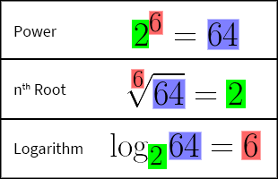

# Overview

**Power** performs an *exponentiation operation*, meaning that it multiplies the `Base` **Value**, against itself, *n* times, with *n* being defined by `Exponent`.

# Exponentiation-Related Nodes

The **Power**, **nth Root**, and **Logarithm** **Nodes** each relate to *exponentiation*. They all take two *known* parameters and return the 3rd *unknown* **Value**. 

# Attributes

|Attribute|Type|Description|
|---|---|---|
|`Data Type`|**Drop-down**|The type of **Data** that will be plugged into the `Base` and `Input` **Sockets**.|

# Inputs

|Input|Type|Description|
|---|---|---|
|*Pulse Input* (►)|**Pulse**|A standard **Input Pulse**, to trigger the execution of the **Node**.|
|`Base`|*Defined in the* `Data Type` ***Attribute**.*|The base **Value**, that will be multiplied against itself multiple times, based on the `Exponent`. |
|`Exponent`|*Defined in the* `Data Type` ***Attribute**.*|The number of times, the `Base` **Value** will be multiplied against itself.|

# Outputs

|Output|Type|Description|
|---|---|---|
|*Pulse Output* (►)|**Pulse**|A standard **Output Pulse**, to move onto the next **Node** along the **Logic Branch**, once this **Node** has finished its execution.|
|`Output`|*Defined in the* `Data Type` ***Attribute**.*|The result of the exponentiation operation.|

# External Links

- [*Exponentiation: Definition & Examples*](https://study.com/academy/lesson/exponentiation-definition-examples-quiz.html) on Study.com.
- [*Exponentiation*](https://en.wikipedia.org/wiki/Exponentiation) on Wikipedia.